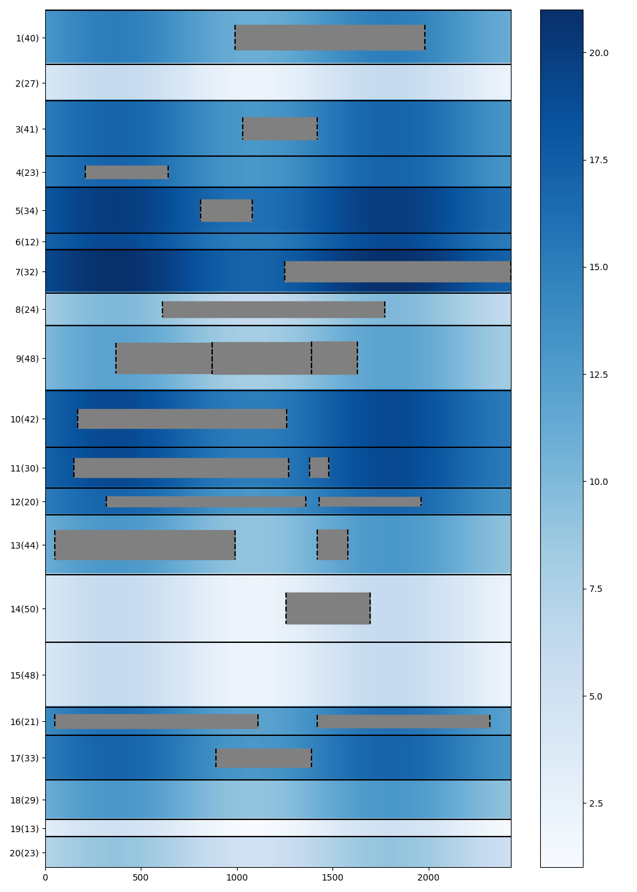
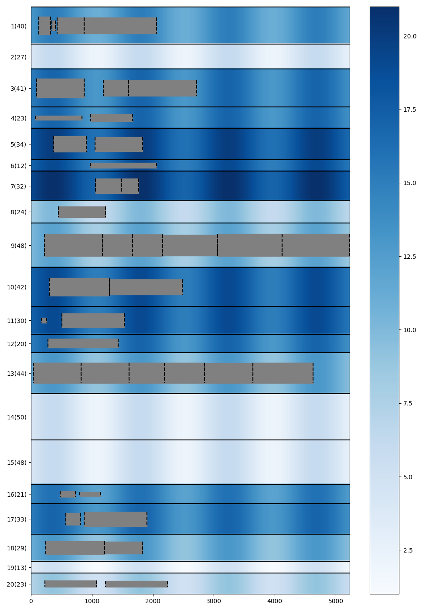
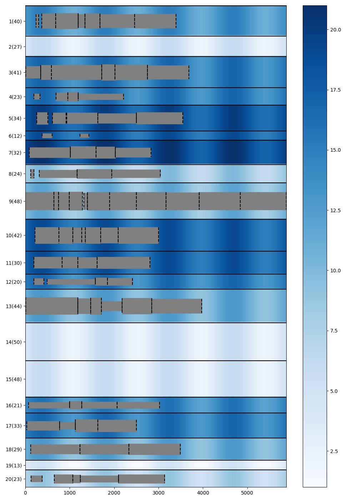
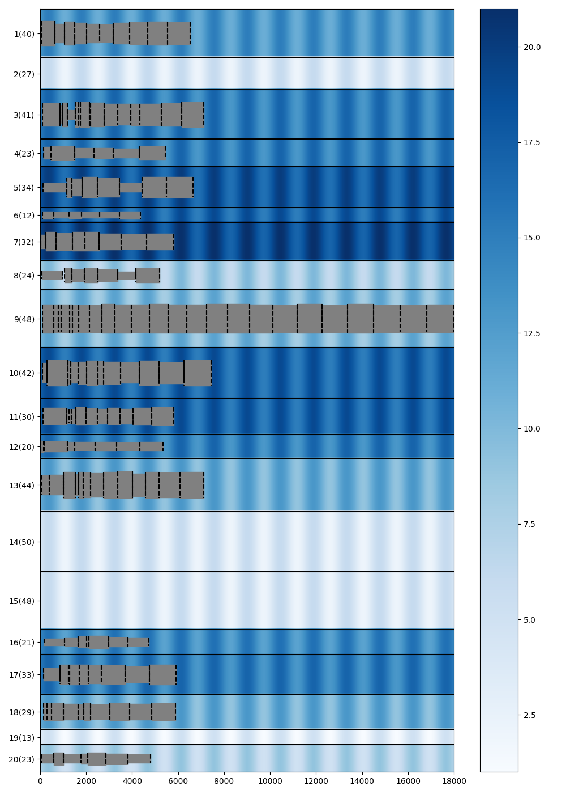

# Project Report

潘俊达 2021201626

## Modeling

| Symbol | Description |
| --- | --- |
| $r_i$ | arrival time |
| $l_i$ | length of the ship |
| $p_i$ | working time |
| $d_i$ | draft of the ship |
| $b_j$ | length of the berth |
| $a$ | amplitude of the tide |
| $T$ | period of the tide |
| $D^t_j$ | depth of the water at time $t$ |
| | $D^t_j = D^0_j + a \sin(\frac{2\pi t}{T})$ |
| $N$ | number of ships |
| $M$ | number of berths |
| $V$ | $\{1, 2, \dots, N\}$ |
| $B$ | $\{1, 2, \dots, M\}$ |
| $O$ | $\{1, 2, \dots, N\}$ |
| $P_i$ | $\{0, 1, \dots, p_i-1\}$ |

### Objective function

| Decision variables | Description |
| --- | --- |
| $x_{ij}$ | 1 if ship $i$ is assigned to berth $j$, 0 otherwise |
| $t_{i}$ | start working time of ship $i$ |
| $y_{ii'}$ | middle variable |

$$
\min \sum_{i \in V}(t_i - r_i) \\
\text{s.t.} \\
\begin {align} 
&\sum_{j \in B} x_{ij} = 1, \forall i \in V \tag{1} \\ 
&r_i - t_i \leq 0, \forall i \in V \tag{2} \\
&x_{ij}x_{i'j}(t_i' + p_i' - t_{i}) \leq My_{ii'}, \forall i, i' \in V, j \in B \tag{3} \\
&x_{ij}x_{i'j}(t_i + p_i - t_{i'}) \leq M(1-y_{ii'}), \forall i, i' \in V, j \in B \tag{4} \\
&x_{ij}(l_i-b_j) \leq 0, \forall i \in V, j \in B  \tag{5} \\
&x_{ij}(d_i - D_j^{t_i+u}) \leq 0, \forall i \in V, j \in B, u \in P_i  \tag{6} \\
&x_{ij} \in \{0, 1\}, \forall i \in V, j \in B  \tag{7} \\
&y_{ii'} \in \{0, 1\}, \forall i, i' \in V  \tag{8} \\
&t_i \geq 0, \forall i \in V  \tag{9} 
\end {align}
$$

(1) Each ship is assigned to exactly one berth.

(2) The start working time of each ship is not earlier than its arrival time.

(3) (4) The working time of two ships assigned to the same berth cannot overlap.

> Original constraint (3) and (4) are:
> $$
> x_{ij}x_{i'j}(t_i' + p_i' - t_{i}) \leq My_{ii'j}, \forall i, i' \in V, j \in B \\
> x_{ij}x_{i'j}(t_i + p_i - t_{i'}) \leq M(1-y_{ii'j}), \forall i, i' \in V, j \in B
> $$
>
> But we can use $y_{ii'}$ instead of $y_{ii'j}$, which won't change the effect of the variables. 

(5) The length of the berth is not shorter than the length of the ship.

(6) The depth of the water is not less than the draft of the ship.

> In the codes, we use piecewise linear function to approximate the sine function. We will discuss it in the following sections.

### Nonlinear to linear

By using gurobi, most nolinear to linear cases can be done automatically. However, as a course
project, we still show how to do it manually.

$$
y = x_1x_2 , \ x \in \{0,1\}\\
\Leftrightarrow
\begin{cases}
y \leq x_1 \\
y \leq x_2 \\
y \geq x_1 + x_2 -1 \\
y \in \{0, 1\}
\end{cases}
$$

$$
y = x_1x_2, \ x_1 \in \{0,1\}, x_2 \in [0,a]\\
\Leftrightarrow
\begin{cases}
y \leq ax_1 \\
y \leq x_2 \\
y \geq x_2 -a(1-x_1) \\
y \geq 0
\end{cases}
$$

$$
y = x_1x_2, \ x_1 \in \{0,1\}, x_2 \in [a,b]\\
\Leftrightarrow
\begin{cases}
y \leq x_2 \\
y \geq x_2 -M(1-x_1) \\
ax_1 \leq y \leq bx_1 \\
\end{cases}
$$

From Gurobi 9.0, it has a new function `Model.addGenConstrSin()` that uses piecewise-linear
approximation to model the sine function. 

> Initially, I use it directly in my codes. 
> 
> But I found it make the model hard to solve. In a fixed time limit, its result is worse than my own piecewise-linear approximation. But after setting the attributes that control the piecewise-linear approximation, it works as good as my own approximation, and run faster. Great!
>
> It is worth noting that piecewise-linear functions were also introduced in version 9.0.

### Approximate solution

#### Method 1

In my model, you need to give each step $ u \in [0, p [i]] $ to establish the water depth conditions, which leads to the huge size of the model.

So I tried to introduce a method of seeking secondary solution.I considers a limit per $STEP$, but this restriction will consider the worst case in the next step.

Use mathematical symbols to be expressed:

$$
x_{ij}(d_i - (D_j^{t_i+u} - D_{w})) \leq 0, \forall i \in V, j \in B, u \in [0, S, 2S, \cdots] \\
, D_w = \mathop{\max}\limits_{|u-v| = 2\pi \cdot S/T} |sin(u) - sin(v)| = 2\sin(\pi \cdot S/T) \\
, 2\pi \cdot S/T < \pi
$$

For example, taking $ S = 200 $, then each ship needs to consider about $1$ to $5$ time points, which greatly reduces the size of the model.

#### Method 2

Another method is just to consider the worst case, that is $D_j^{0} - a$, 
in most cases, it can also get a good solution in a short time.

#### Method 3

Combine the above two methods, we can get a better one:

For a time-consuming ship, we use method 2 because is is likely to encounter the worst case.

For a time-saving ship, we use method 1 because we can set the step smaller and get a more accurate solution.

Also we can add a "or" condition to time-saving ships, if it meet method 2, it's also ok.

### Greedy algorithm

I found the model is still hard to find a feasible solution in a short time. So I use a greedy algorithm to find one, and use it as the initial solution of the model.

The greedy algorithm is as follows:

The free time of each port is a linked list, and the ship is arranged in the order of arrival time. For a port, we find the first time period can be arranged through the linked list. When we have checked K port, the earliest can be arranged is the answer to the ship.

Here, when we judge whether the water depth is satisfied, we consider the worst case, that is, $D_j^{0} - a$.

There is a special design: In order to avoid falling into a local optimal solution, the order of our traversal is random, and when the available port of the current ship has been found more than 10, it stops traversal. On the one hand, this can avoid local optimal solution, on the other hand, this can reduce the operating time.

We repeated the above process multiple times, taking the best greedy solution as the initial solution of the model.

For the data of 160 ships, it only takes 1 second to get a feasible solution.

Experiments show that the initial solution obtained by this method is far better than the initial solution obtained by Gurobi itself.

### Experiment results

| dataset | total waiting time |
| ------- | ----------------- |
| ships20 | 886 |
| ships40 | 14100 |
| ships80 | 39740 |
| ships160 | 331950 |

You can find detailed results in the `opt-result` folder.

> Because the water level changes are calculated with discrete values, there will be some error in the results.

#### ships20

This data is small enough, so we can get the optimal solution in a short time (105s). Here, we show the results of method 1,2 and 3.

In order to unify different datasets, we choose the average waiting time as the evaluation indicator.

| thresh | step | optimal solution | time cost (s) |
| ------ | ---- |---------------- | ---- |
| 0 (method 2 for all) | - | 55.0 | 1 |
| 600  |60 | 50.45 | 25 |
| $\infty$ (method 1 for all) |1| **44.3** | 32 |

> greedy solution: 69.0

> Here we also reflect the length of the boat and port (for aesthetic purposes, the display width of the ship has been multiplied by 0.5).

#### ships40, ships80, ships160

When the data is large, the model is difficult for simplex to solve. In my experiment, I can only get
meaningful results when use method 2 for all ships. (that is $d_i < D_j^{0} - a$)

> I have no idea why gurobi can't improve the initial solution at all when use method 1.

| dataset | greedy solution | sub-optimal solution | gap | time limit (s) |
| ------ | ---- |---------------- | ---- | ---- |
| ships40 |  480.0 |  352.5 | 18.8% | 3600 |
| ships80 |  732.3 |  496.8 | 64.0% | 7200 |
| ships160 |  2792.1 |  2074.7 | 59.4% | 10800 |

> The visualization results of these three datasets can be found in the appendix.

### Further discussion

#### How to improve the model?

According to the above experimental results, the "short board" is the large ship that requires 48+ length of the port. 

A simple idea that we can apply method 1 only to these long and time-consuming ships.

But after trying, I found that it didn't work. Better greedy algorithm that considers the low tide also didn't work. This may be because the large ships tend to need more time to working, so most of the time, they will encounter the low tide.

#### Heuristic algorithm

For such a complicated model, the heuristic algorithm can achieve better results in more cases, but the timing of this project is chapter of linear programming in the course, so this project mainly focuses on linear programming models.

## Appendix

ships20

ships40

ships80

ships160

