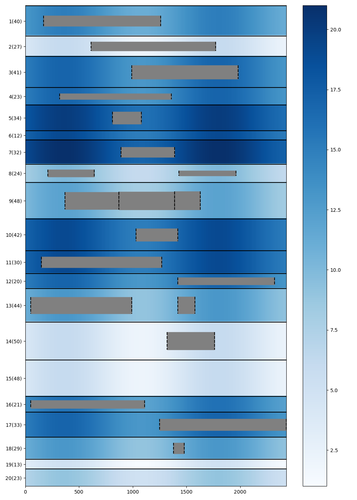
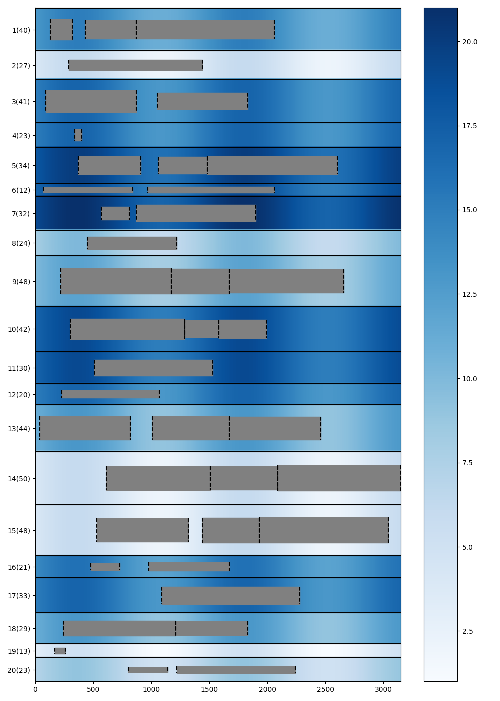
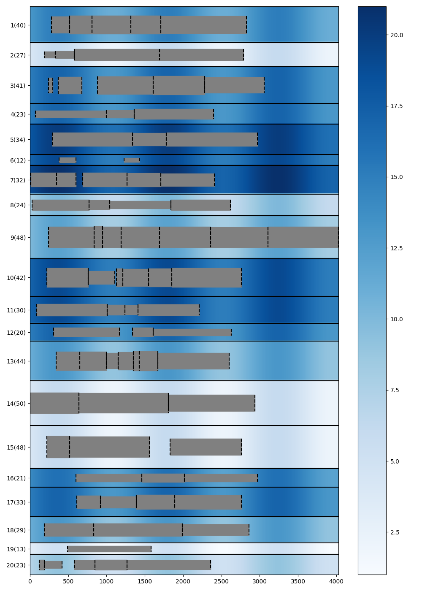
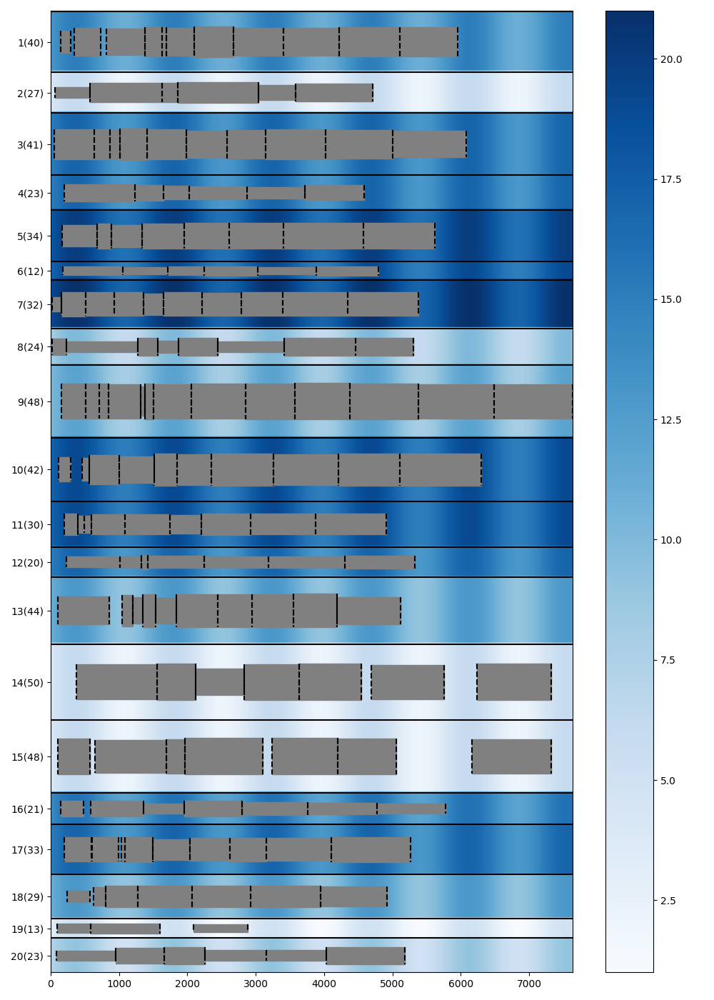

# Project Report

潘俊达 2021201626

> 简介：本实验使用了3种方法，分别是贪心，线性规划，多线程遗传算法。分别是用 python, gurobipy, c++ 实现的。
>
> 实验结果：对于 ships20，线性规划能快速求得最优解，遗传算法经过一段时间也可以得到最优解，但没有线性规划的最优性保证。
> 对于 ships40 线性规划在时间代价下能取得更好的效果，对于 ships80,160，遗传算法能取得更好的效果。
>
> 在 5 月份，我完成了一份基于线性规划和分段线性函数的版本，彼时的问题假设是全时间段要满足水深。在 6 月底，完成了对线性规划版本的重要改进，并补充了遗传算法版本，改写了问题条件即改成只要进出港的时候满足。
>
> 因为篇幅原因，5 月份的版本和全时段水深的问题的结果，不在本文档中展示。可见 report_old.pdf 或 result 文件夹。

## Linear Programming Model

| Symbol  | Description                                |
| ------- | ------------------------------------------ |
| $r_i$   | arrival time                               |
| $l_i$   | length of the ship                         |
| $p_i$   | working time                               |
| $d_i$   | draft of the ship                          |
| $b_j$   | length of the berth                        |
| $a$     | amplitude of the tide                      |
| $T$     | period of the tide                         |
| $D^t_j$ | depth of the water at time $t$             |
|         | $D^t_j = D^0_j + a \sin(\frac{2\pi t}{T})$ |
| $N$     | number of ships                            |
| $M$     | number of berths                           |
| $V$     | $\{1, 2, \dots, N\}$                       |
| $B$     | $\{1, 2, \dots, M\}$                       |
| $O$     | $\{1, 2, \dots, N\}$                       |
| $P_i$   | $\{0, 1, \dots, p_i\}$ or $\{0, p_i\}$     |

> Note that for full time version problem, $P_i = \{0, 1, \dots, p_i\}$, for two ends version problem, $P_i = \{0, p_i\}$.

### Objective function

| Decision variables | Description                                         |
| ------------------ | --------------------------------------------------- |
| $x_{ij}$           | 1 if ship $i$ is assigned to berth $j$, 0 otherwise |
| $t_{i}$            | start working time of ship $i$                      |
| $y_{ii'}$          | middle variable                                     |


$$
\min \sum_{i \in V}(t_i - r_i) \\
\text{s.t.} \\
\begin {align} 
&\sum_{j \in B} x_{ij} = 1, \forall i \in V \tag{1} \\ 
&r_i - t_i \leq 0, \forall i \in V \tag{2} \\
&x_{ij}x_{i'j}(t_i' + p_i' - t_{i}) \leq My_{ii'}, \forall i, i' \in V, j \in B \tag{3} \\
&x_{ij}x_{i'j}(t_i + p_i - t_{i'}) \leq M(1-y_{ii'}), \forall i, i' \in V, j \in B \tag{4} \\
&x_{ij}(l_i-b_j) \leq 0, \forall i \in V, j \in B  \tag{5} \\
&x_{ij}(d_i - D_j^{t_i+u}) \leq 0, \forall i \in V, j \in B, u \in P_i  \tag{6} \\
&x_{ij} \in \{0, 1\}, \forall i \in V, j \in B  \tag{7} \\
&y_{ii'} \in \{0, 1\}, \forall i, i' \in V  \tag{8} \\
&t_i \geq 0, \forall i \in V  \tag{9} 
\end {align}
$$

(1) Each ship is assigned to exactly one berth.

(2) The start working time of each ship is not earlier than its arrival time.

(3) (4) The working time of two ships assigned to the same berth cannot overlap.

> Original constraint (3) and (4) are:
> $$
> x_{ij}x_{i'j}(t_i' + p_i' - t_{i}) \leq My_{ii'j}, \forall i, i' \in V, j \in B \\
> x_{ij}x_{i'j}(t_i + p_i - t_{i'}) \leq M(1-y_{ii'j}), \forall i, i' \in V, j \in B
> $$
>
> But we can use $y_{ii'}$ instead of $y_{ii'j}$, which won't change the effect of the variables. 

(5) The length of the berth is not shorter than the length of the ship.

(6) The depth of the water is not less than the draft of the ship.

> In the codes, we use piecewise linear function to approximate the sine function. We will discuss it in the following sections.

### Nonlinear to linear

By using gurobi, most nolinear to linear cases can be done automatically. However, as a course project, we still show how to do it manually.

$$
y = x_1x_2 , \ x \in \{0,1\}\\
\Leftrightarrow
\begin{cases}
y \leq x_1 \\
y \leq x_2 \\
y \geq x_1 + x_2 -1 \\
y \in \{0, 1\}
\end{cases}
$$

$$
y = x_1x_2, \ x_1 \in \{0,1\}, x_2 \in [0,a]\\
\Leftrightarrow
\begin{cases}
y \leq ax_1 \\
y \leq x_2 \\
y \geq x_2 -a(1-x_1) \\
y \geq 0
\end{cases}
$$

$$
y = x_1x_2, \ x_1 \in \{0,1\}, x_2 \in [a,b]\\
\Leftrightarrow
\begin{cases}
y \leq x_2 \\
y \geq x_2 -M(1-x_1) \\
ax_1 \leq y \leq bx_1 \\
\end{cases}
$$

#### piecewise sine

We can use the piecewise linear function to approximate the sine function like this:


#### step sine

But for this problem, because the depth is an integer, we can use the ladder function to better approximate the sine function.


在旧报告里，我使用piecewise sine建模，现在我用step sine，取得了更好的效果，所以以下的讨论都是基于step sine的，为了方便，我仍然称模型为 "A variant of the above Linear programming model

In the old report, I used "piecewise sine" for modeling, but now I use "step sine" to achieve better results. Therefore, the following discussion is based on the step sine. For convenience, I still refer to the model as "A variant of the above Linear programming model".

### A variant of the above Linear programming model (in old report): using step sine

The disadvantage of the above model is that no matter which similar method is adopted, it cannot build a model with a reasonable complexity to find the optimal solution, so we consider some modifications of the model.

Because the working range in the data is at most one cycle, as long as we get the steps located at the beginning and end of the step function, we can directly determine the lowest water depth without need to care about the middle process.


Using a modeling technique called "SOS2", we can get a variable for the region where the $x$ is located.

$$
x = \sum_{k=0}^{6} w_k \cdot x_k\\
\sum_{k=0}^{6} w_k = 1\\
\sum_{k=0}^5 z_k = 1\\
w_0 \leq z_0\\
w_1 \leq z_0 + z_1\\
\cdots\\
w_5 \leq z_4 + z_5\\
w_6 \leq z_5\\
w_k \geq 0\\
z_k \in \{0, 1\}\\
$$

$x_k = 0, \frac{\pi}{6}, \frac{5\pi}{6}\cdots$

Here, $z_k$ indicates $x$ on which step.

In addition, we can build the model for modulus calculation.

$$
x = q \cdot 2\pi + r\\
0 \leq r < 2\pi\\
q \in \mathbb{Z}\\
$$

In summary, we can get the step where it starts and where it ends, and whether they spans a cycle ($ o = q_2 -q_1 = 1 $).

Set $ z_k^{(0)} $ indicates that the step where it starts is $k$, and $ z_k^{(1)} $ indicates that the step where it ends.

Set $ f (k_0, k_1, o) $ to indicate the lowest tide in this case, which is quite easy to calculate in advance.

We can build the lowest tide expression as follows:

$$
\text{tide}_{min} = (1-o) \sum_{k_0 \leq k_1} z_{k_0}^{(0)} z_{k_1}^{(1)} f(k_0,k_1,0) + o \sum_{k_0 \geq k_1} z_{k_0}^{(0)} z_{k_1}^{(1)} f(k_0,k_1,1)
$$

> Because the working time of the ship does not exceed one cycle, if at the same cycle, you can only consider the situation of $ k_0 \leq k_1 $.

$$
x_{ij}(d_i - D_j^{t_i+u}) \leq 0, \forall i \in V, j \in B, u \in P_i \\
\Rightarrow \\
x_{ij}[d_i - (D_j^{0} + \text{tide}_{\text{min}})] \leq 0, \forall i \in V, j \in B \\
$$

Theoretically, the above methods have greatly reduced the size of the model.

### Greedy algorithm

I found the model is still hard to find a feasible solution in a short time. So I use a greedy algorithm to find one, and use it as the initial solution of the model.

The greedy algorithm is as follows:

The free time of each port is a linked list, and the ship is arranged in the order of arrival time. For a port, we find the first time period can be arranged through the linked list. When we have checked K port, the earliest can be arranged is the answer to the ship.

Here, when we judge whether the water depth is satisfied, we consider the worst case, that is, $D_j^{0} - a$.

There is a special design: In order to avoid falling into a local optimal solution, the order of our traversal is random, and when the available port of the current ship has been found more than 10, it stops traversal. On the one hand, this can avoid local optimal solution, on the other hand, this can save the calculation time.

We repeated the above process multiple times, taking the best greedy solution as the initial solution of the model.

For the data of 160 ships, it only takes 1 second to get a feasible solution.

Experiments show that the initial solution obtained by this method is far better than the initial solution obtained by Gurobi itself.

### Twoends version problem

In the above variant model, we have constructed a method to describe the start and end times, so at this point, we just need to add 2 constraints separately, like this:

$$
\text{tide}_{st} = \sum_{k_0} z_{k_0}^{(0)}f(k_0) \\
x_{ij}[d_i - (D_j^{0} + \text{tide}_{\text{st}})] \leq 0, \forall i \in V, j \in B \\
\ \\
\text{tide}_{ed} = \sum_{k_1} z_{k_1}^{(0)}f(k_1) \\
x_{ij}[d_i - (D_j^{0} + \text{tide}_{\text{ed}})] \leq 0, \forall i \in V, j \in B
$$

Essentially, the above process can be seen as manually implementing piecewise linear functions using the SOS2 method.

## Genetic algorithm

> 时间关系，这里用中文

### 编码与适应度计算

染色体用实数编码，每个个体有两条染色体，分别表示每艘船处理的优先级和处理的港口。

这里我们只考虑进出港需要满足水深的情况。

因为 sin 函数的周期性，我们总是可以视可行的工作时间是周期性的线段，比如对于 `delta = ship.depth - port.depth = 1` 的船港对，可行的工作时间是 $[\frac{\pi}{6} + 2k\pi,\frac{5\pi}{6}+ 2k\pi]$。

因为船的工作时间小于一个周期，所以船要正常工作只有两种情况，一是在某一个周期的可行线段内，二是横跨两个周期的可行线段。


记 $st_i,ed_i$ 表示对于 `ship.depth - port.depth` = $i$，在第一个周期内的可行线段的起点和终点。

则非跨越对应： `work_time < ed - st`

跨越对应：`work_time > st + T -ed`

以此为基础，每个船的可行港口是可以事先确定的。

更进一步，给定一个时间 $u$，和可行船港对，求：在 $u$ 之后，最早可以安排船只的时间点是可以 $O(1)$ 求出的。

```cpp
int calc_start_time(int current_time, const Port& port, const Ship& ship) {
    int delta = ship.depth - port.depth;
    if (delta <= -2) {
        return max(current_time, ship.arrival_time);
    }
    static constexpr const int step = T / 12;
    static constexpr const int st[] = {-step, 0, step}, ed[] = {7 * step, 6 * step, 5 * step};
    int idx = delta + 1;
    current_time = max(current_time, ship.arrival_time);
    int u = (current_time - st[idx]) % T + st[idx];  // u = [st, st + T)
    int n = (current_time - st[idx]) / T;
    if (u < st[idx]) {
        u += T;
        n--;
    }
    int next_time = 1e9;
    if (ship.work_time <= ed[idx] - st[idx]) {  // no jmp
        int tmax0 = ed[idx] - ship.work_time;
        int tmin1 = st[idx] + T;
        if (u < tmax0) {
            next_time = min(next_time, u + n * T);
        } else {
            next_time = min(next_time, tmin1 + n * T);
        }
    }
    if (ship.work_time >= st[idx] + T - ed[idx]) {     // jmp
        int tmin0 = st[idx] + T - ship.work_time;      // 本周期最早开始时间
        int tmax0 = ed[idx];                           // 本周期最晚开始时间
        int tmin1 = st[idx] + 2 * T - ship.work_time;  // 下周期最早开始时间
        if (u < tmax0) {
            next_time = min(next_time, max(tmin0, u) + n * T);
        } else {
            next_time = min(next_time, tmin1 + n * T);
        }
    }
    return next_time;
}
```

于是，对于一个个体，利用其基因，加上排序优先级，就可以 $O(n\log n)$ 地计算出适应度，或者是总推迟时间。

这里，适应度用 $M - \text{delay}$ 表示，$M$ 是为了使结果非负的一个数。在轮盘赌中有具体的用法。

### 选择

实现了三种选择方式，截断，轮盘赌，锦标赛。

实测，最简单的截断取得了最好的效果，大概率是因为其更好地搜索了设计空间，但其实三者差异不大，锦标赛如果设置合理可以更快收敛到相近水平。

不妨碍来看看其他两种选择方式：

锦标赛的超参很容易调整，而且也能取得了很好的效果。但缺点是如果模拟锦标赛，复杂度和候选集大小成正比。

而轮盘赌算法，最初，我采用 $\max(\text{delay}) - \text{delay}_i$ 作为适应度，用 $\frac{\text{fitness}}{\sum\text{fitness}}$ 作为选中概率，但是效果并不佳，远不及锦标赛。在考虑如何设置概率函数时，一开始我考虑进行指数变换，但是发现比较难调整参数，最后我受到了锦标赛的启发：

考虑到如果候选集大小 $t$ 固定，那么锦标赛中每个个体的选中概率可以被事先计算出来，从而可以用轮盘赌的方式来实现锦标赛，而且获得更好的时间复杂度。

具体计算如下：考虑排名为 $d$ 的个体 $i$，种群数量为 $p$，则有：

$$
\mathbb{P}(\text{i is selected}) = (\frac{p-d}{p})^t - (\frac{p-d-1}{p})^t \quad {t \geq 2}
$$

这样的概率函数，不受目标函数值的影响，具有更好的鲁棒性。

最后，选择了截断法，实现时用 `nth_element` 来实现，该部分复杂度为 $O(p)$。

### 交叉和变异

两条基因的交叉变异方法不一样。

对于优先级，这相当于一个全排列，所以用 OX 交叉和交换变异。

对于港口，用 n 点交叉或均匀交叉和随机变异。

实测，均匀交叉能更好地搜索设计空间，取得更好的效果。

> 均匀交叉即每个点以相同的概率来自双亲。

### 多线程优化

记种群数量为 $p$，船的数量为 $n$，则每轮迭代的时间复杂度为 $O(pn\log n)$。

这一整个过程都可以并行化，所以我们用多线程来加速。实测，在家用笔记本上可以取得 2 倍的加速比。在 20 核服务器上，可以达到至高 7 倍的加速比。效果显著。

### 实现细节

经过测试，除了上文提到的锦标赛优于轮盘赌，均匀交叉优于n点交叉，我还测试了变异比例取 0.1 到 0.3，结果表明影响不大。影响最大的参数是种群数量和锦标赛候选集大小。以下是实验采用的具体参数。

| dataset | population size | truncation size | round |
| ------- | --------------- | --------------- | ----- |
| 20      | 1000            | 100              | 30    |
| 40      | 30000           | 600              | 4000    |
| 80      | 30000           | 600              | 200    |
| 160      | 30000           | 600              | 80    |

对于每个数据集，遗传算法会被执行 round 轮取最好的结果。

> 为了验证遗传算法和线性规划在 ships40 上的表现，ships40 的执行时间被刻意延迟到相同水平。80/160 则保持1小时。
> 
> 另外，为了体现遗传算法的时间优越性，我们还做了较短时间的实验（轮数远小于以上水平），结果也比线性规划好，具体结果见下一节。

## Experiment results

> Only show two ends version problem's results.
>
> Both algorithms run in parallel with 20 cores on the same server.
>
> CPU: 12th Gen Intel(R) Core(TM) i7-12700K @ 3.60GHz

### Linear programming

| dataset  | greedy algorithm | linear programming*     | gap   | time limit (s) |
| -------- | ------------ | ---------- | ----- | -------------- |
| ships20  | 1380         | **950**    | 0%    | 5              |
| ships40  | 19200        | **4440**   | 34.0% | 3600           |
| ships80  | 39740        | **32160**  | 89.0% | 4800           |
| ships160 | 446736       | **297720** | 96%   | 7200           |

> The visualization results can be found in the appendix.

### Genetic algorithm

| dataset  | linear programming | genetic algorithm (mini round)     | time cost (s) |
| -------- | ------------ | ---------- | -------------- |
| ships20  | **950**        | **950**    | 1              |
| ships40  | **4440**        | 4570   | 50           |
| ships80  | 32160        | **27430** | 100           |
| ships160 | 297720       | **211260** | 300           |

| dataset  | linear programming | genetic algorithm*     | time cost (s) |
| -------- | ------------ | ---------- | -------------- |
| ships20  | **950**        | **950**    | 1              |
| ships40  | **4440**        | 4450   | 3600           |
| ships80  | 32160        | **22980** | 100           |
| ships160 | 297720       | **207900** | 300           |

> It can be seen that there is no big gap between Linear programming and genetic algorithm for the problem of moderate scale, and Linear programming can ensure the optimality of the results. But for large-scale problems, genetic algorithms have achieved significant advantages.

## Appendix

### Linear programming

#### ships20


#### ships40


#### ships80


#### ships160


### Genetic algorithm



#### ships40



#### ships80



#### ships160

