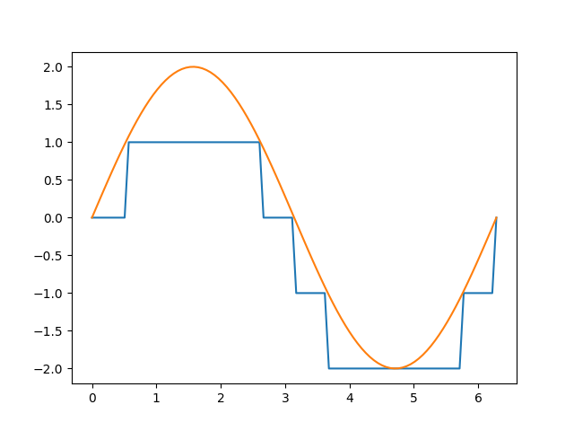

# Project Report

潘俊达 2021201626

## Modeling

| Symbol | Description |
| --- | --- |
| $r_i$ | arrival time |
| $l_i$ | length of the ship |
| $p_i$ | working time |
| $d_i$ | draft of the ship |
| $b_j$ | length of the berth |
| $a$ | amplitude of the tide |
| $T$ | period of the tide |
| $D^t_j$ | depth of the water at time $t$ |
| | $D^t_j = D^0_j + a \sin(\frac{2\pi t}{T})$ |
| $N$ | number of ships |
| $M$ | number of berths |
| $V$ | $\{1, 2, \dots, N\}$ |
| $B$ | $\{1, 2, \dots, M\}$ |
| $O$ | $\{1, 2, \dots, N\}$ |
| $P_i$ | $\{0, 1, \dots, p_i-1\}$ |

### Objective function

| Decision variables | Description |
| --- | --- |
| $x_{ij}$ | 1 if ship $i$ is assigned to berth $j$, 0 otherwise |
| $t_{i}$ | start working time of ship $i$ |
| $y_{ii'}$ | middle variable |

$$
\min \sum_{i \in V}(t_i - r_i) \\
\text{s.t.} \\
\begin {align} 
&\sum_{j \in B} x_{ij} = 1, \forall i \in V \tag{1} \\ 
&r_i - t_i \leq 0, \forall i \in V \tag{2} \\
&x_{ij}x_{i'j}(t_i' + p_i' - t_{i}) \leq My_{ii'}, \forall i, i' \in V, j \in B \tag{3} \\
&x_{ij}x_{i'j}(t_i + p_i - t_{i'}) \leq M(1-y_{ii'}), \forall i, i' \in V, j \in B \tag{4} \\
&x_{ij}(l_i-b_j) \leq 0, \forall i \in V, j \in B  \tag{5} \\
&x_{ij}(d_i - D_j^{t_i+u}) \leq 0, \forall i \in V, j \in B, u \in P_i  \tag{6} \\
&x_{ij} \in \{0, 1\}, \forall i \in V, j \in B  \tag{7} \\
&y_{ii'} \in \{0, 1\}, \forall i, i' \in V  \tag{8} \\
&t_i \geq 0, \forall i \in V  \tag{9} 
\end {align}
$$

(1) Each ship is assigned to exactly one berth.

(2) The start working time of each ship is not earlier than its arrival time.

(3) (4) The working time of two ships assigned to the same berth cannot overlap.

> Original constraint (3) and (4) are:
> $$
> x_{ij}x_{i'j}(t_i' + p_i' - t_{i}) \leq My_{ii'j}, \forall i, i' \in V, j \in B \\
> x_{ij}x_{i'j}(t_i + p_i - t_{i'}) \leq M(1-y_{ii'j}), \forall i, i' \in V, j \in B
> $$
>
> But we can use $y_{ii'}$ instead of $y_{ii'j}$, which won't change the effect of the variables. 

(5) The length of the berth is not shorter than the length of the ship.

(6) The depth of the water is not less than the draft of the ship.

> In the codes, we use piecewise linear function to approximate the sine function. We will discuss it in the following sections.

### Nonlinear to linear

By using gurobi, most nolinear to linear cases can be done automatically. However, as a course project, we still show how to do it manually.

$$
y = x_1x_2 , \ x \in \{0,1\}\\
\Leftrightarrow
\begin{cases}
y \leq x_1 \\
y \leq x_2 \\
y \geq x_1 + x_2 -1 \\
y \in \{0, 1\}
\end{cases}
$$

$$
y = x_1x_2, \ x_1 \in \{0,1\}, x_2 \in [0,a]\\
\Leftrightarrow
\begin{cases}
y \leq ax_1 \\
y \leq x_2 \\
y \geq x_2 -a(1-x_1) \\
y \geq 0
\end{cases}
$$

$$
y = x_1x_2, \ x_1 \in \{0,1\}, x_2 \in [a,b]\\
\Leftrightarrow
\begin{cases}
y \leq x_2 \\
y \geq x_2 -M(1-x_1) \\
ax_1 \leq y \leq bx_1 \\
\end{cases}
$$

#### piecewise sine

We can use the piecewise linear function to approximate the sine function like this:

#### step sine

But for this problem, because the depth is an integer, we can use the ladder function to better approximate the sine function.

At the end of the report, we will introduce the modeling method corresponding to this curve. We call it a "variant model", and the idea is not the same, and it has better performance.

Below we first introduce modeling skills based on the piecewise sine.

### Further discussion about "piecewise sine"

In my model, you need to give each step $ u \in [0, p [i]] $ to establish the water depth conditions, which leads to the huge size of the model. These are some optimization methods I have adopted.

#### Method 1

I tried to introduce a method of seeking secondary solution.I considers a limit per $STEP$, but this restriction will consider the worst case before the next step.

Use mathematical symbols to be expressed:

$$
x_{ij}(d_i - (D_j^{t_i+u} - D_{w})) \leq 0, \forall i \in V, j \in B, u \in [0, S, 2S, \cdots] \\
, D_w = \mathop{\max}\limits_{|u-v| = 2\pi \cdot S/T} |sin(u) - sin(v)| = 2\sin(\pi \cdot S/T) \\
, 2\pi \cdot S/T < \pi
$$

For example, taking $ S = 200 $, then each ship needs to consider about $1$ to $5$ time points, which greatly reduces the size of the model.

#### Method 2

Another method is just to consider the worst case, that is $D_j^{0} - a$, in most cases, it can also get a good solution in a short time.

#### Method 3

Combine the above two methods, we can get a better one:

For a time-consuming ship, we use method 2 because is is likely to encounter the worst case.

For a time-saving ship, we use method 1 because we can set the step smaller and get a more accurate solution.

Also we can add a "or" condition to time-saving ships, if it meet method 2, it's also ok.

### Greedy algorithm

I found the model is still hard to find a feasible solution in a short time. So I use a greedy algorithm to find one, and use it as the initial solution of the model.

The greedy algorithm is as follows:

The free time of each port is a linked list, and the ship is arranged in the order of arrival time. For a port, we find the first time period can be arranged through the linked list. When we have checked K port, the earliest can be arranged is the answer to the ship.

Here, when we judge whether the water depth is satisfied, we consider the worst case, that is, $D_j^{0} - a$.

There is a special design: In order to avoid falling into a local optimal solution, the order of our traversal is random, and when the available port of the current ship has been found more than 10, it stops traversal. On the one hand, this can avoid local optimal solution, on the other hand, this can save the calculation time.

We repeated the above process multiple times, taking the best greedy solution as the initial solution of the model.

For the data of 160 ships, it only takes 1 second to get a feasible solution.

Experiments show that the initial solution obtained by this method is far better than the initial solution obtained by Gurobi itself.

### A variant of the above Linear programming model: using step sine

The disadvantage of the above model is that no matter which similar method is adopted, it cannot build a model with a reasonable complexity to find the optimal solution, so we consider some modifications of the model.

Because the working range in the data is at most one cycle, as long as we get the steps located at the beginning and end of the step function, we can directly determine the lowest water depth without need to care about the middle process.

Using a modeling technique called "SOS2", we can get a variable for the region where the $x$ is located.

$$
x = \sum_{k=0}^{6} w_k \cdot x_k\\
\sum_{k=0}^{6} w_k = 1\\
\sum_{k=0}^5 z_k = 1\\
w_0 \leq z_0\\
w_1 \leq z_0 + z_1\\
\cdots\\
w_5 \leq z_4 + z_5\\
w_6 \leq z_5\\
w_k \geq 0\\
z_k \in \{0, 1\}\\
$$

$x_k = 0, \frac{\pi}{6}, \frac{5\pi}{6}\cdots$

Here, $z_k$ indicates $x$ on which step.

In addition, we can build the model for modulus calculation.

$$
x = q \cdot 2\pi + r\\
0 \leq r < 2\pi\\
q \in \mathbb{Z}\\
$$

In summary, we can get the step where it starts and where it ends, and whether they spans a cycle ($ o = q_2 -q_1 = 1 $).

Set $ z_k^{(0)} $ indicates that the step where it starts is $k$, and $ z_k^{(1)} $ indicates that the step where it ends.

Set $ f (k_0, k_1, o) $ to indicate the lowest tide in this case, which is quite easy to calculate in advance.

We can build the lowest tide expression as follows:

$$
\text{tide}_{min} = (1-o) \sum_{k_0 \leq k_1} z_{k_0}^{(0)} z_{k_1}^{(1)} f(k_0,k_1,0) + o \sum_{k_0 \geq k_1} z_{k_0}^{(0)} z_{k_1}^{(1)} f(k_0,k_1,1)
$$

> Because the working time of the ship does not exceed one cycle, if at the same cycle, you can only consider the situation of $ k_0 \leq k_1 $.

$$
x_{ij}(d_i - D_j^{t_i+u}) \leq 0, \forall i \in V, j \in B, u \in P_i \\
\Rightarrow \\
x_{ij}[d_i - (D_j^{0} + \text{tide}_{\text{min}}] \leq 0, \forall i \in V, j \in B \\
$$

Theoretically, the above methods have greatly reduced the size of the model.

### Experiment results

| dataset | greedy algorithm | original model | variant model |
| ------- | ----------------- | -------------- | ------------- |
| ships20 | 1380 | **950** | **950** |
| ships40 | 19200 | 14100 | **9270** |
| ships80 | 58584 | 39740 | **32160** |
| ships160 | 446736 | 331950 | **297720** |

#### Original model

Before we talk about the variant model, let's see the results of the original model.

You can find detailed results in the [`result/approx/`](../result/approx/) folder.

##### ships20

This data is small enough, so we can get the optimal solution in a short time (500s). Here, we show the results of method 1 and 2 mentioned in Further discussion about "piecewise sine".

| thresh | step | optimal solution | time cost (s) |
| ------ | ---- |---------------- | ---- |
| 0 (method 2 for all) | - | 1100 | 5 |
| $\infty$ (method 1 for all) |1| **950** | 500 |

> greedy solution: 1380, improved: 31.1%

> Here we also reflect the length of the boat and port (for aesthetic purposes, the display width of the ship has been multiplied by 0.5).

##### ships40, ships80, ships160

When the data is large, the model is difficult for simplex to solve. In my experiment, I can only get
meaningful results when use method 2 for all ships. (that is $d_i < D_j^{0} - a$)

> I have no idea why gurobi can't improve the initial solution at all when use method 1.

| dataset | greedy algorithm | original model | gap | time limit (s) | improved |
| ------ | ---- |---------------- | ---- | ---- | ---- |
| ships40 |  19200 |  14100 | 18.8% | 3600 | 26.5% |
| ships80 |  58584 |  39740 | 64.0% | 7200 | 32.1% |
| ships160 |  446736 |  331950 | 59.4% | 10800 | 25.8% |

> The visualization results of these three datasets can be found in the appendix.

#### Variant model

The variant model can get much better results than the original model. For example, it need only few seconds to get the optimal solution for ships20, which need 500s for the original model.

| dataset | original model | variant model | gap | time cost (s) | improved |
| ------- | -------------- | ------------- | --- | ------------- | -------- |
| ships20 | **950** | **950** | 0% | 5 | 0% |
| ships40 | 14100 | **9270** | 36.5% | 3600 | 34.3% |
| ships80 | 39740 | **32160** | 89.0% | 4800 | 19.1% |
| ships160 | 331950 | **297720** | 96% | 7200 | 10.3% |

You can find detailed results in the [`result/approx/`](../result/opt/) folder.

> The visualization results of these datasets can be found in the appendix.

### Further discussion

#### How to improve the model

According to the above experimental results, the "short board" is the large ship that requires 48+ length of the port. 

A simple idea that we can apply method 1 only to these long and time-consuming ships.

But after trying, I found that it didn't work. Better greedy algorithm that considers the low tide also didn't work. This may be because the large ships tend to need more time to working, so most of the time, they will encounter the low tide.

#### Heuristic algorithm

For such a complicated model, the heuristic algorithm can achieve better results in more cases, but the timing of this project is chapter of linear programming in the course, so this project mainly focuses on linear programming models.

## Appendix

### ships20

### ships40 

#### variant model

#### original model

### ships80

#### variant model

#### original model

### ships160

#### variant model

#### original model

